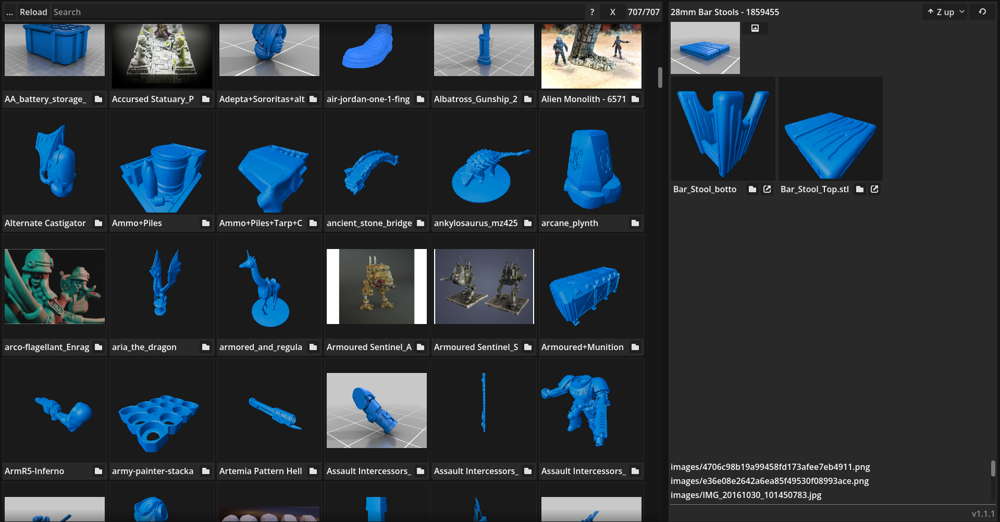
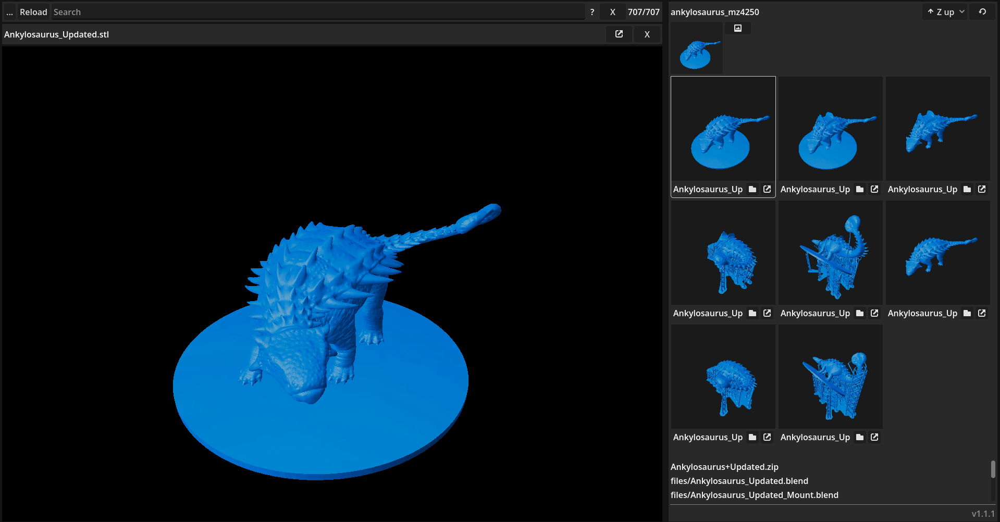

Browser/organizer for 3d printable models made for personal use.
The code is available here in case someone wants to do something similar.

# Building rust
Rust code will build automatically when running or exporting the project.
The first export to windows will take a while, because the cross compilation needs some setup.

## Dependencies
- Cargo
- cross, for cross compiling to windows: `cargo install cross`